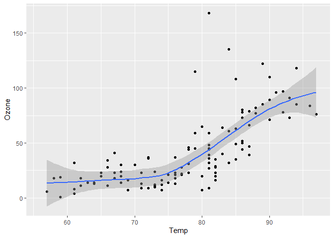

---

# QmdMD

[Quarto](https://quarto.org) makes it easy to render scientific posts with [Python](https://www.python.org) and [R](https://www.r-project.org), but for personal websites using a static site generator, such as [Jekyll](https://jekyllrb.com), you need markdown files with a little more _markup_. This extension does just that! It converts QMD files into [Kramdown](https://kramdown.gettalong.org)-compliant markdown files, adds custom YAML metadata, and ensures links, images, and other entities are correctly formatted. With simple configuration options in the `qmdmd` YAML header field, you can easily modify paths for images and organize figures. Need custom metadata in your markdown front-matter? Populate the output YAML header with additional metadata from the `meta` YAML header tree of your `.qmd` document.

## Installation

To install this extension in your current directory (or into the Quarto project that you're currently working in), use the following command:

```bash
quarto add Khlick/QmdMD
```

## Options

The `qmdMD` extension supports customization through the `qmdmd` section in the YAML header of your Quarto documents. Here are the options you can set:

| Option      | Description                                                                                                     | Default Value |
|-------------|-----------------------------------------------------------------------------------------------------------------|---------------|
| **fig-rel** | Specifies the relative root for image paths.                                                                    | `"."`         |
| **fig-root**| Specifies an additional root path for images. This can be useful if you want to place all figures in a specific directory. | `""`          |

#### Example YAML Configuration

Here is an example of how to use these options in the YAML header of a Quarto document, `ggplot2-demo.qmd`:

```markdown
---
title: ggplot2 demo
author: Khris Griffis, Ph.D.
format: qmdmd-gfm
qmdmd:
  fig-rel: ".."
  fig-root: "assets/figures"
---

## Air Quality

@fig-airquality further explores the impact of temperature on ozone level.

```{r}
#| label: fig-airquality
#| fig-cap: "Temperature and ozone level."
#| warning: false

library(ggplot2)

ggplot(airquality, aes(Temp, Ozone)) + 
  geom_point() + 
  geom_smooth(method = "loess")
```
```

#### Example Renders

<div>

{width="100%"}

_**Figure 1.** Comparison between Quarto renders from QmdMD (left) and Quarto GFM (right). QmdMD renders a block of YAML front-matter based on the input metadata for further rendering by Kramdown (or other markdown parser) in the GFM style._

</div>

Rendering the file to quarto-style markdown with `quarto render ggplot2-demo-markdown.md --to markdown` yields Quarto's new(er) cell encoding scheme:

<div>

```markdown
[Figure 1](#fig-airquality){.quarto-xref}
further explores the impact of temperature on ozone level.

:::: cell
``` {.r .cell-code}
library(ggplot2)

ggplot(airquality, aes(Temp, Ozone)) + 
  geom_point() + 
  geom_smooth(method = "loess")
```

::: cell-output-display

:::
::::
```
_**Figure 2.** Markdown rendering in Quarto yields Quarto-style `cell` encodings. These encodings are not compatible with Kramdown or other GFM parsers._

</div>


The extension will log any changes made to the figure paths during processing. This ensures you can track the modifications and adjust your project structure accordingly.

## Features

### Custom YAML front-matter
Custom YAML front-matter may be inserted into the rendered markdown (`.md`) by utilizing the `meta:` YAML field in the `.qmd` file:

```yaml
meta:
  tags:
    - featured
    - neuroscience
  options:
    - someOption
```
Which will render at the base level of the output file's YAML front-matter:
```yaml
tags:
- featured
- neuroscience
options:
- someOption
```
The `.qmd` header is expected to have fields `author`, `title`, and `date`, where `date` is optional as the extension will automatically populate it with the rendered date (formatted as `%Y-%m-%d %H:%M:%S %z`). Further, the extension appends a new metadata field, `generated-on`, which has the date of rendering (formmatted as `%Y-%m-%d` ).

### Kramdown-Compliant Markdown

A major feature of the extension is the parsing of Quarto's Github Flavored Markdown ([`gfm`](https://quarto.org/docs/output-formats/gfm.html)) to be compliant with my Kramdown markdown processor. 


## Usage

You can either place the format in the QMD file's YAML header:

```yaml
---
# document metadata
format: qmdmd-gfm
---
```

Or by using the Quarto `--to, -t` option for `render`:

```bash
quarto render document.qmd --to qmdMD-gfm
```

## Example

For a complete example, please refer to the [template.qmd](./template.qmd) and its rendered output [template.md](./template.md).

---

## Requirements

Only [Quarto](https://quarto.org/) 1.5.5x or greater is required for the extension. However, to render the [`template.qmd`](./template.qmd), you'll also need R and Python available to your quarto installation (see [`quarto check`](https://quarto.org/docs/troubleshooting/#check-the-version-of-quarto-and-its-dependencies)).

At the time of writing, here's my installation:
```bash
Quarto 1.6.1
[>] Checking versions of quarto binary dependencies...
      Pandoc version 3.2.0: OK
      Dart Sass version 1.70.0: OK
      Deno version 1.41.0: OK
      Typst version 0.11.0: OK
[>] Checking versions of quarto dependencies......OK
[>] Checking Quarto installation......OK
      Version: 1.6.1
      Path: ~\AppData\Local\Programs\Quarto\bin
      CodePage: 1252

[>] Checking tools....................OK
      TinyTeX: (not installed)
      Chromium: (not installed)

[>] Checking LaTeX....................OK
      Tex:  (not detected)

[>] Checking basic markdown render....OK

[>] Checking Python 3 installation....OK
      Version: 3.12.1
      Path: ./qmdMD/.python312/Scripts/python.exe
      Jupyter: 5.7.2
      Kernels: python3

[>] Checking Jupyter engine render....OK

[>] Checking R installation...........OK
      Version: 4.2.2
      Path: ~/R/R-42~1.2
      LibPaths:
        - ~/R/win-library/4.2
        - ~/R/R-4.2.2/library
      knitr: 1.45
      rmarkdown: 2.27

[>] Checking Knitr engine render......OK
```

The `template.qmd` requires the following R and Python libraries

### R Packages

- `knitr`
- `reticulate`
- `ggplot2`
- `rmarkdown`

### Python Packages

- `numpy`
- `matplotlib`
- `pandas`
- `jupyter`


[^1]: In the future, figure files generated by Quarto will be moved to the specified `fig-root` directory.