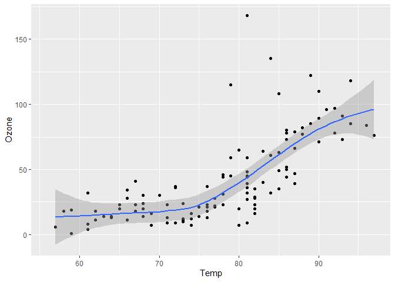
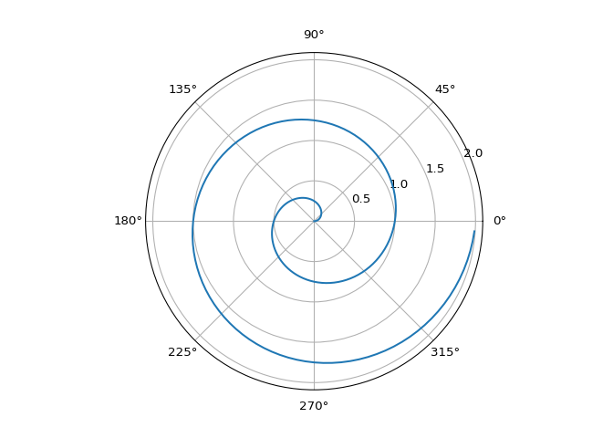

# Test Draft Post

``` r
knitr::opts_chunk$set(
  fig.path = "./assets/images/"
)
getwd()
```

    [1] "J:/OneDrive/Programming/_github/qmdMD"

``` r
library("reticulate")
matplotlib <- import("matplotlib")
```

## Introduction

This is a sample document to demonstrate the usage of the `qmdMD` Quarto
extension.

## Code Example

Below is a simple Python code block that will be processed by the
extension with chunk options, `#| echo: true` and `#| output: asis`.

``` python
print('Hello world')
```

Hello world

Let's also use R:

``` r
a <- 5+4
print(a)
```

    [1] 9

Here is a plot in R where [Figure 1](#fig-airquality) further explores
the impact of temperature on ozone level.

``` r
library(ggplot2)

ggplot(airquality, aes(Temp, Ozone)) + 
  geom_point() + 
  geom_smooth(method = "loess")
```

<div id="fig-airquality">




Figure 1: Temperature and ozone level.

</div>

## Code Example With Plot

``` python
import numpy as np
import matplotlib.pyplot as plt

r = np.arange(0, 2, 0.01)
theta = 2 * np.pi * r
fig, ax = plt.subplots(
  subplot_kw = {'projection': 'polar'} 
)
ax.plot(theta, r)
ax.set_rticks([0.5, 1, 1.5, 2])
ax.grid(True)
plt.show()
```



## Code Example With Pretty Table

Here we can see that if we imported `numpy` above, we can use it in a
different code cell.

``` python
import pandas as pd

temps = pd.DataFrame({
  'year': [*range(1920, 1925)],
  'Jan': [40.6, 44.2, 37.5, 41.8, 39.3], 
  'Jun': [58.5, 58.7, 57.8, 52.7, 57.7]
}).set_index('year')

def make_pretty(styler):
  styler.background_gradient(axis=None,
    vmin=31, vmax=66, cmap="RdYlGn_r")
  return styler

temps.style.pipe(make_pretty)
```

<style type="text/css">
#T_127f4_row0_col0 {
  background-color: #96d268;
  color: #000000;
}
#T_127f4_row0_col1 {
  background-color: #f57547;
  color: #f1f1f1;
}
#T_127f4_row1_col0 {
  background-color: #cdea83;
  color: #000000;
}
#T_127f4_row1_col1 {
  background-color: #f57245;
  color: #f1f1f1;
}
#T_127f4_row2_col0 {
  background-color: #5ab760;
  color: #f1f1f1;
}
#T_127f4_row2_col1 {
  background-color: #f7814c;
  color: #f1f1f1;
}
#T_127f4_row3_col0 {
  background-color: #a9da6c;
  color: #000000;
}
#T_127f4_row3_col1 {
  background-color: #fed683;
  color: #000000;
}
#T_127f4_row4_col0 {
  background-color: #7dc765;
  color: #000000;
}
#T_127f4_row4_col1 {
  background-color: #f7844e;
  color: #f1f1f1;
}
</style>
<table id="T_127f4">
  <thead>
    <tr>
      <th class="index_name level0" >year</th>
      <th id="T_127f4_level0_col0" class="col_heading level0 col0" >Jan</th>
      <th id="T_127f4_level0_col1" class="col_heading level0 col1" >Jun</th>
    </tr>
  </thead>
  <tbody>
    <tr>
      <th id="T_127f4_level0_row0" class="row_heading level0 row0" >1920</th>
      <td id="T_127f4_row0_col0" class="data row0 col0" >40.600000</td>
      <td id="T_127f4_row0_col1" class="data row0 col1" >58.500000</td>
    </tr>
    <tr>
      <th id="T_127f4_level0_row1" class="row_heading level0 row1" >1921</th>
      <td id="T_127f4_row1_col0" class="data row1 col0" >44.200000</td>
      <td id="T_127f4_row1_col1" class="data row1 col1" >58.700000</td>
    </tr>
    <tr>
      <th id="T_127f4_level0_row2" class="row_heading level0 row2" >1922</th>
      <td id="T_127f4_row2_col0" class="data row2 col0" >37.500000</td>
      <td id="T_127f4_row2_col1" class="data row2 col1" >57.800000</td>
    </tr>
    <tr>
      <th id="T_127f4_level0_row3" class="row_heading level0 row3" >1923</th>
      <td id="T_127f4_row3_col0" class="data row3 col0" >41.800000</td>
      <td id="T_127f4_row3_col1" class="data row3 col1" >52.700000</td>
    </tr>
    <tr>
      <th id="T_127f4_level0_row4" class="row_heading level0 row4" >1924</th>
      <td id="T_127f4_row4_col0" class="data row4 col0" >39.300000</td>
      <td id="T_127f4_row4_col1" class="data row4 col1" >57.700000</td>
    </tr>
  </tbody>
</table>

## Inline Code Example

Here is an example of inline code: $1+1=`{python} 1+1`$.

## Math Example

We can use the fundamental theorem of calculus to say that
$\int_2^3 x^2 \, dx=\frac{3^3}{3}-\frac{2^3}{3}=\frac{19}{3}$. Also note
that
$\displaystyle \int_2^3 x^2 \, dx=\frac{3^3}{3}-\frac{2^3}{3}=\frac{19}{3}$.

We can also give this equation its own line

$$
    \int_2^3 x^2 \, dx=\frac{3^3}{3}-\frac{2^3}{3}=\frac{19}{3}.
$$

## Conclusion

This concludes the sample document. You can modify this template to suit
your needs.
